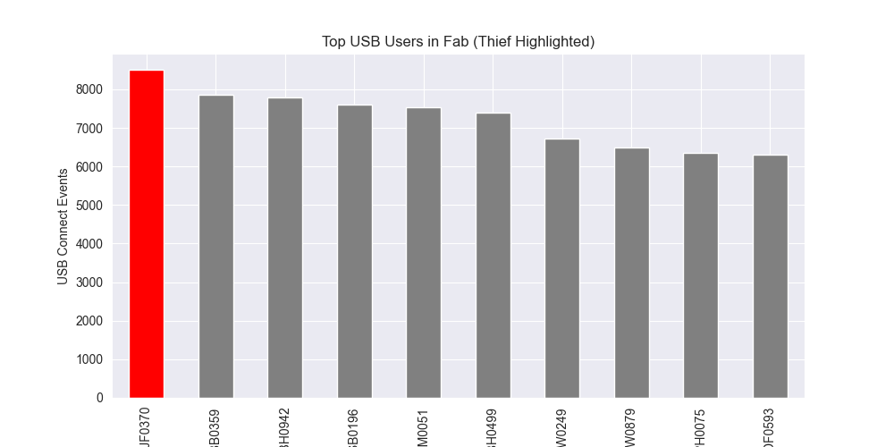
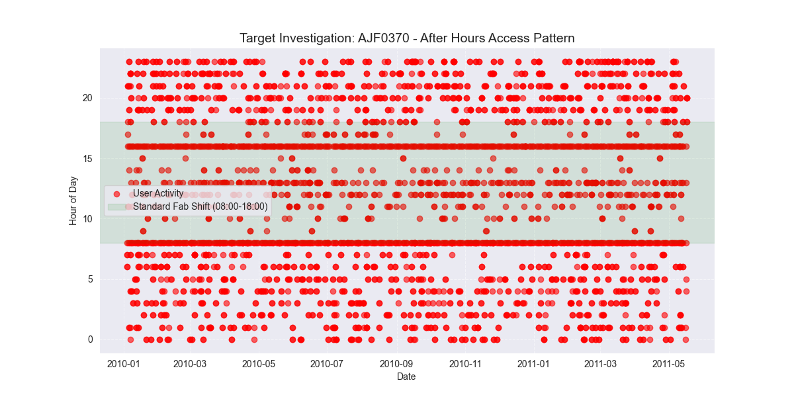

Project: Insider Risk Detection - Semiconductor Fab Simulation

Objective: Simulating a security analyst role to detect IP theft (GDSII Mask Data) using the CERT Insider Threat Dataset.

Methodology: I utilized Python (Pandas) to replicate Splunk detection logic. I wrote algorithms to correlate two distinct data streams:

Identity Logs (IAM): Flagging anomalous login times (outside 08:00-19:00 shift windows).

Endpoint Logs (DLP): Cross-referencing those times with Removable Media (USB) connections.

Results:

Identified User AJF0370 as a critical risk.
Visual Evidence: Highest frequency of USB-connect events in the dataset

User consistently accessed the network between 00:00-06:00 AM and immediately connected a USB device.
